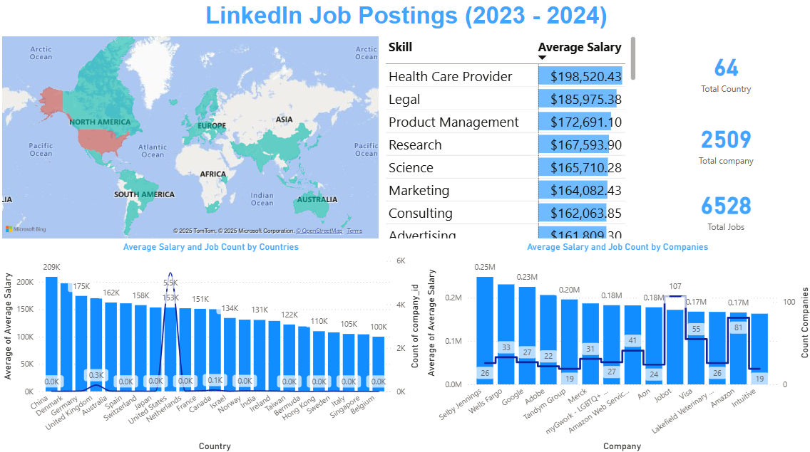

# Linkedin Job Posting 2023 - 2024

This Power BI dashboard analyzes **6,528 job postings** collected from LinkedIn between 2023–2024, **covering 64 countries and 2,509 companies**. It highlights salary insights, in-demand skills, and country-level hiring trends across the global tech and professional landscape.

## 📁 Files Included
- `LinkedIn job posting 2023-2024.pbix` - Main Power BI report file
- `data.xlsx` - Data used for report file
- `Screenshots/` - Preview images of the report

## 📊 Features

- Displays the geographical spread of job postings across major countries and continents.
- Compares average salaries offered by companies like Google, Adobe, Wells Fargo, Amazon, and more.
- List of high-paying skills such as Product Management, Research, Science, Legal, and Healthcare.

## 📷 Screenshot

## 🔧 Tools Used
- Power BI Desktop
- Microsoft Excel (for data cleaning)

## 📌 How to Use
- Open *LinkedIn job posting 2023-2024.pbix* in Power BI Desktop.
- Connect or replace with your own job dataset
- Refresh visuals to update insights.
